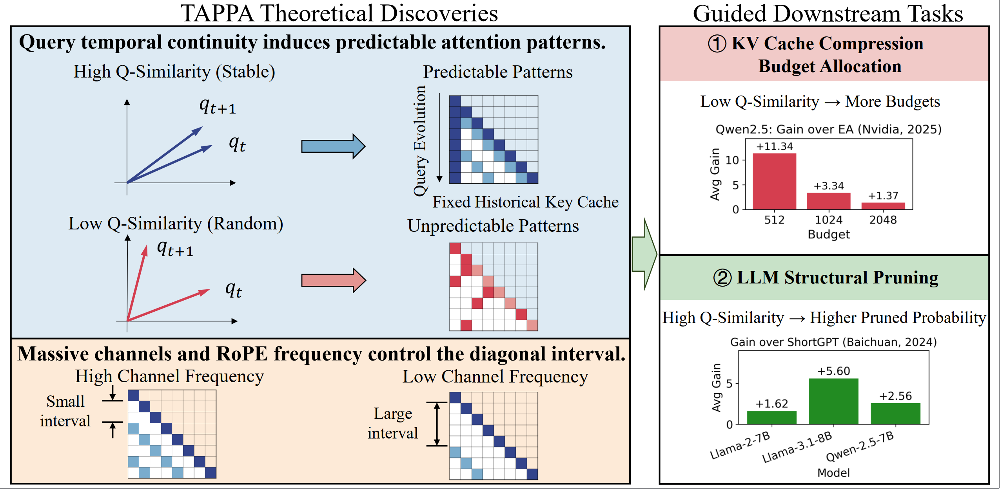
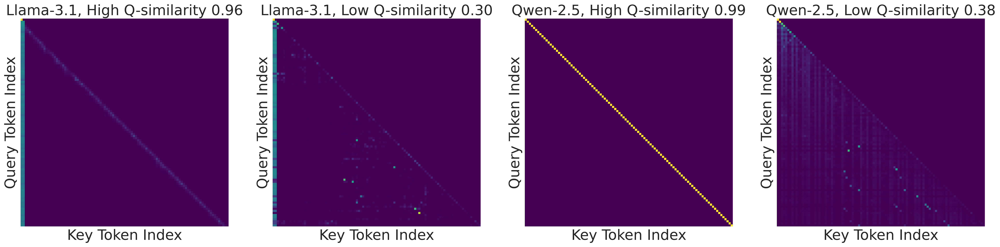

<div align="center">

# TAPPA: Temporal Attention Pattern Predictability Analysis

### Why Attention Patterns Exist: A Unifying Temporal Perspective Analysis (ICLR 2026)


<a href="https://arxiv.org/abs/2601.21709"></a>
<a href="https://openreview.net/forum?id=XhqoDBouWS"></a>

</div>

This repository contains the official implementation of **Temporal Attention Pattern Predictability Analysis (TAPPA)**, published as a conference paper at **ICLR 2026**.

TAPPA provides a unified temporal perspective to explain diverse attention patterns by analyzing their mathematical formulation through **query temporal behavior** and the **response of RoPE channels**. It further translates these insights into practical acceleration signals, such as **q-similarity**, to guide inference-time methods including **KV cache compression** and **structural pruning**.

## News

- **[2026.01.26]** TAPPA is published as a conference paper at **ICLR 2026**.
- **[2026.02.04]** Initial open-source release: **KVCache** module (q-similarity guided budget allocation).
- **[2026.02.04]** Release **Prune** module (TAPPA-guided structural pruning).
- **[TODO]** Release **Visualization** module (see roadmap).

## Overview

<p align="center">
  <a href="assets/intro.png">
    
  </a>
</p>


The overview figure summarizes TAPPA from theory to practice. TAPPA models the step-wise query vectors and the induced attention distributions as a time series, and shows that **temporal continuity of queries**, quantified by **q-similarity**, separates attention behaviors into **predictable patterns** with stable regularities and **unpredictable patterns** that lack stable step-to-step structure. This theoretical quantity is then reused as a lightweight inference-time signal.

TAPPA leverages q-similarity to guide two downstream acceleration tasks. **For KV cache compression**, lower q-similarity is assigned **more budget** (token retention), achieving up to **+11.34** average gain over **EA (NVIDIA, 2025)** on **Qwen2.5** at **budget 512**. **For LLM structural pruning**, higher q-similarity corresponds to a **higher pruning probability**, achieving up to **+5.60** average gain over **ShortGPT (Baichuan, 2024)** on **Llama-3.1-8B**.

References.

* Devoto et al. *Expected Attention: KV Cache Compression by Estimating Attention from Future Queries Distribution*. arXiv:2510.00636, 2025.
* Men et al. *ShortGPT: Layers in Large Language Models are More Redundant Than You Expect*. arXiv:2403.03853, 2024.


## Key Insight: Query Self-Similarity Explains Predictability

<p align="center">
  
</p>

The distinction between **predictable** and **unpredictable** attention patterns can be explained by the degree of **query self-similarity along the temporal dimension (q-similarity)**: high q-similarity corresponds to stable query evolution and clearer regularities; low q-similarity corresponds to noisier evolution and more irregular patterns.


## Repository Structure

This repository is organized into three modules:

| Module             |       Status | Description                                                                                     |
| ------------------ | -----------: | ----------------------------------------------------------------------------------------------- |
| `KVCache/`       | ✅ Available | KV cache compression code and scripts related to q-similarity guided budget allocation.         |
| `Prune/`         | ✅ Available | Structural pruning code used in TAPPA-guided pruning experiments.                               |
| `Visualization/` |      ⏳ TODO | Visualization utilities for attention patterns, q-similarity statistics, and pattern galleries. |

## Getting Started

For installation and reproduction, please follow the module-level documentation:

- **KV cache compression:** `KVCache/README.md`
- **Pruning:** `Prune/README.md`
- **Visualization (planned):** `Visualization/README.md`

## Related Project: AttentionPredictor

TAPPA is closely related to our earlier work **AttentionPredictor (NeurIPS 2025)**, which learns a lightweight convolution model to capture spatiotemporal patterns and predict the next-token attention score.

* **Paper:** [AttentionPredictor: Temporal Pattern Matters for Efficient LLM Inference](https://arxiv.org/abs/2502.04077)
* **Project repository:** [MIRALab-USTC/LLM-AttentionPredictor](https://github.com/MIRALab-USTC/LLM-AttentionPredictor)

## Citation

If this repository is useful for research, please cite:

```bibtex
@misc{yang2026whyattentionpatterns,
  title        = {Why Attention Patterns Exist: A Unifying Temporal Perspective Analysis},
  author       = {Qingyue Yang and Jie Wang and Xing Li and Yinqi Bai and Xialiang Tong and Huiling Zhen and Jianye Hao and Mingxuan Yuan and Bin Li},
  year         = {2026},
  eprint       = {2601.21709},
  archivePrefix= {arXiv},
  primaryClass = {cs.CL}
}

@article{yang2024attentionpredictor,
    title={AttentionPredictor: Temporal Pattern Matters for Efficient LLM Inference},
    author={Yang, Qingyue and Wang, Jie and Li, Xing and Wang, Zhihai and Chen, Chen and Chen, Lei and Yu, Xianzhi and Liu, Wulong and Hao, Jianye and Yuan, Mingxuan and others},
    journal={arXiv preprint arXiv:2502.04077},
    year={2025}
}
```
